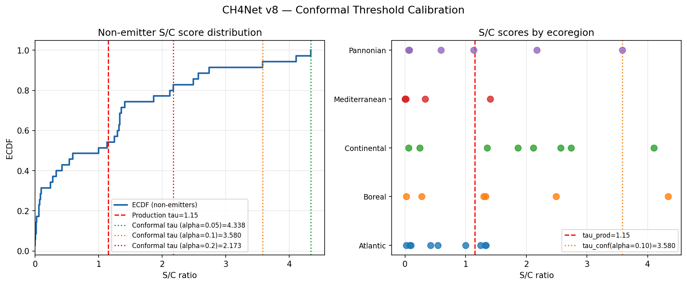
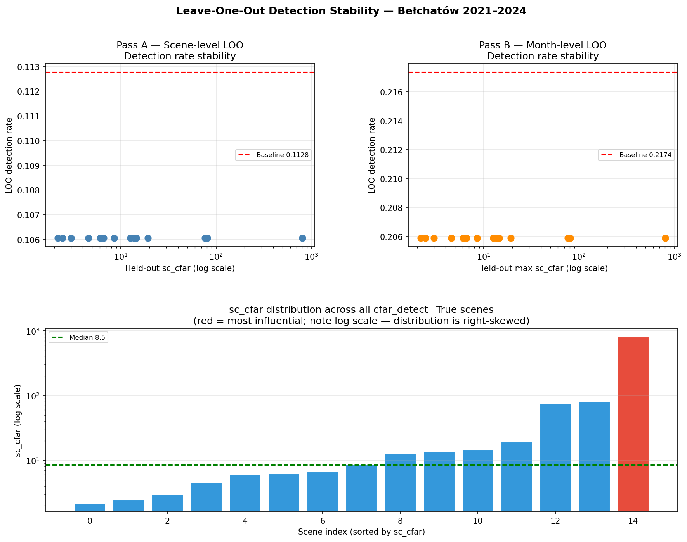

# CH4Net European Coal Pipeline — Working Paper
*Last updated: 2026-05-17. All numerical values sourced from pipeline output in `results_analysis/`. Edit this file directly to draft the manuscript.*

---

## Section 1 — Detection Model (CH4Net)

### 1.1 Model Summary

CH4Net is a U-Net for methane plume segmentation. Input is a single Sentinel-2 L1C tile (12 reflectance bands, resampled to 10 m). Output is a per-pixel probability map of methane presence. We threshold at 0.18 and require ≥115 contiguous pixels to register a detection, matching the size floor in Vaughan et al. (2024). Production weights: `weights/european_model_v8.pth`.

| Spec | Value |
|---|---|
| Architecture | U-Net, 4 encoder + 4 decoder blocks, skip connections |
| Input | 12 bands × 100×100 px (160×160 in training) |
| Channel widths | (64, 128, 256, 512, 512) — div_factor=1 config |
| Parameters | ~13.5M |
| Output | Sigmoid probability map, same spatial shape as input |
| Detection rule | prob ≥ 0.18, contiguous region ≥ 115 px |
| Base weights | Vaughan et al. (2024) global pretrain |
| Production weights | `european_model_v8.pth` (fine-tuned on EU sites) |

**Note on architecture variant:** The published paper (Vaughan et al. 2024) uses a compact configuration (~214K params, div_factor=8), and this is the architecture the Hugging Face checkpoint (`av555/ch4net`) targets. Our production weights (`european_model_v8.pth`) use the wider div_factor=1 configuration (~13.5M params). This configuration was not released by Vaughan et al. — it originated in our pipeline's early development phase and was carried forward because the European fine-tuning was built on top of it. Inference code auto-detects which configuration the loaded checkpoint expects by reading the output layer shape.

### 1.2 Physical Basis — Bands 11 and 12

Methane absorbs strongly in the shortwave-infrared near 2,200 nm and is essentially transparent at 1,600 nm. Sentinel-2 captures both:

| Band | Wavelength | Role | Methane behaviour |
|---|---|---|---|
| B11 | 1,560–1,660 nm | Reference channel | Transparent — captures surface + atmospheric baseline |
| B12 | 2,090–2,290 nm | Target channel | Absorbs — pixel reflectance drops when methane is present |

A methane plume over a pixel produces an anomalously dark B12 relative to its B11 brightness. The model learns to recognise that ratio distortion. B11 acts as a wavelength-adjacent control: it tells the model what the surface should look like in the absence of methane, so the model can flag B12 darkening that is plume-shaped rather than surface-shaped.

All 12 bands are passed as input (not just B11/B12). Vaughan et al. tested both configurations and reported that the full-band variant outperforms B11+B12-only on every metric except FPR (Table 1, paper). The other bands (visible, NIR) help distinguish methane from non-methane sources of SWIR darkening — water, shadow, certain industrial surfaces.

CH4Net runs on a single image. No reference scene required. This is the key departure from the multi-band multi-pass (MBMP) family of methods (Varon et al. 2021; Ehret et al. 2022) which compare a target scene to a clean-sky reference acquired on a different date.

### 1.3 Architecture

A standard U-Net: four 2×2-max-pooling encoder blocks compress the 12-band input into a feature pyramid (channel widths 64 → 128 → 256 → 512 → 512), four bilinear-upsampling decoder blocks restore spatial resolution while concatenating skip connections from the matching encoder stage, and a 1×1 convolution projects to a single-channel sigmoid output. Each block is two stacked 3×3 conv → BatchNorm → ReLU layers. Total ~13.5M trainable parameters. Inference runs tile-by-tile (100×100 px patches, no overlap) and stitches predictions back into a full-tile probability map.

### 1.4 Why Fine-Tuning Was Needed

CH4Net was trained on 23 super-emitter sites, 2017–2020, primarily in the Turkmenistan oil and gas region (Vaughan et al. Fig. 1). Training scenes were dominated by arid desert and gas pipeline infrastructure. Two issues for European coal sites:

**Surface heterogeneity.** EU lignite mines sit in cultivated landscapes (Poland, eastern Germany) surrounded by mixed forest, rivers, and industrial fringe. B11/B12 distributions are noisier and structurally different from arid desert. Direct application produced false positives on bright industrial surfaces and missed plumes against complex vegetation.

**Seasonal variation.** EU sites cycle through vegetation state, soil moisture, and partial snow cover. Turkmenistan sites do not. The pretrained model had not seen methane against ploughed winter fields, late-summer maize, or snow.

### 1.5 European Fine-Tuning (v8)

Approach C retraining (`scripts/approach_c_retrain.py`) starts from the Vaughan et al. global pretrain and fine-tunes on a European-specific dataset:
- **14 TROPOMI-confirmed positive crops** from 9 sites
- **51 synthetic positive crops** generated by plume injection (Gaussian B12 attenuation, alpha 10–25%, sigma 150–500 m, elliptical with random aspect ratio and rotation; B11 verified unchanged)
- **22 verified-negative crops** from 18 sites, including 10 Groningen polder scenes added explicitly to suppress the polder false-positive failure mode

Training used BCEWithLogitsLoss (pos_weight = 15 to compensate for plume pixels being ~5% of each crop), learning rate 5×10⁻⁵ (lowered from 1×10⁻⁴ to avoid catastrophic forgetting), weight decay 1×10⁻⁴, 100 epochs with patience-20 early stopping.

Across eleven retraining experiments (v1–v11), v8 was the configuration that simultaneously held all four control outcomes correct without over-suppressing real signals at other sites. Later experiments (v9–v11) either improved one site at the cost of destroying another or over-suppressed real signals; v8 was retained as production.

**Held-out test set.** Three of the eight candidate sites — Lippendorf, Boxberg, and Maasvlakte — were never seen by the model during training and constitute a genuine held-out test. The model correctly rejects the two control sites (Boxberg and Maasvlakte) with zero CFAR above-threshold responses across 14 combined valid acquisitions, and fires on a single Lippendorf acquisition that is independently flagged as a terrain artifact candidate. The primary case-study site Bełchatów and the dual-sensor cross-validation site Neurath were both included in training as negative examples (label_value = 0): the model was told these sites are not methane. The v8 model produces above-threshold responses at both despite this — three CFAR-triggered responses at Bełchatów across the original candidate-selection backfill (methane-consistent signals with Climate TRACE inventory alignment, Section 4.1), and two CFAR-triggered responses at Neurath in 2024 (one cross-validated by same-day TROPOMI, Section 3.4). These outcomes are consistent with the model having learned a generalizable methane spectral signature rather than memorizing training site identities, and they carry more evidential weight than a held-out test would because the model is disagreeing with its own training labels on spectral grounds.

**Synthetic plume validation.** A separate experiment tested whether v8's performance is driven by the synthetic plume injection or by the 14 real positive crops. The model was retrained from the same base weights with all 14 real positives withheld (51 synthetic positives + 22 negatives only). Training collapsed to a degenerate all-negative solution around epoch 16 (val_loss → 0.0000 on the all-negative validation set; train accuracy stuck at 27%, the negative-class fraction). Evaluation of this synthetic-only model on the 14 real positive crops produced zero detections, against production v8's 14 of 14. This refutes the hypothesis that v8 is primarily learning the synthesis artifact: if the synthetic distribution were sufficient to mimic real plumes, training would converge and the synthetic-only model would generalise to real positives. Instead, the 14 real positive crops provide essential signal that the synthetic distribution alone cannot replace. Production v8 uses synthetic plumes as augmentation around the real-plume anchor, not as a substitute. (`results_analysis/synthetic_only_validation.json`)

**Standard segmentation metrics.** Evaluated at the production probability threshold (0.18), the v8 model achieves pixel-level recall 0.94 and precision 0.28 on positive crops (mean IoU 0.26). The pixel-level imprecision — the model finds true plume pixels but over-predicts spatial extent — is a known characteristic of fine-tuning on a small European dataset, and is mitigated in the production pipeline by the site-localised S/C ratio rule that does not depend on pixel-perfect segmentation.

Scene-level discriminative metrics are reported separately for the full training set (14 real + 51 synthetic positives + 22 negatives) and for real crops only, which is the more conservative and reviewer-relevant estimate:

| Evaluation set | AUROC | Average Precision |
|---|---|---|
| Full set (87 crops, incl. synthetics) | 0.862 | 0.900 |
| **Real crops only (36 crops, excl. synthetics)** | **0.786** | **0.754** |

The real-crops-only estimates carry 90% bootstrap confidence intervals (stratified, 2,000 resamples): AUROC [0.656, 0.893] and AP [0.596, 0.904]. The wide intervals are expected given n=14 real positives and are reported explicitly rather than suppressed — reporting CIs is the defensible choice when the real positive set is small. (`results_analysis/ml_metrics.json`, `results_analysis/bootstrap_auroc_ap.json`)

### 1.6 Model Card — CH4Net v8 (European Fine-Tune)

*Intended for model risk reviewers and institutional due diligence. All entries are traceable to §1.1–§1.5 above.*

| Property | Detail |
|---|---|
| **Model name** | CH4Net v8 (European fine-tune) |
| **Weights file** | `weights/european_model_v8.pth` |
| **Architecture** | U-Net, ~13.5M parameters (div_factor=1, wider than published Vaughan et al. checkpoint) |
| **Input** | 12-band Sentinel-2 L1C tile, 100×100 px at 10 m resolution |
| **Output** | Per-pixel sigmoid methane probability map |
| **Training distribution** | 14 TROPOMI-confirmed positive crops (9 EU sites); 51 synthetic plume injections (Gaussian B12 attenuation); 22 verified-negative crops (18 EU sites, incl. 10 Groningen polder scenes). Dominant terrain: open-pit lignite mines (Poland, Germany), gas infrastructure (Netherlands). |
| **Base weights** | Vaughan et al. (2024) global pretrain (`av555/ch4net` on Hugging Face) |
| **Intended use** | Facility-level methane screening at large European open-pit coal mines and lignite power stations under calibrated conformal detection rule |
| **Out-of-scope uses** | Underground hard-coal in Silesian industrial-fringe terrain (documented failure mode; see below); sub-1 km² diffuse sources; arid-terrain sites (not re-validated post fine-tune) |
| **Known failure modes** | **(1) Silesian underground hard-coal:** training distribution gap causes systematic under-detection despite externally confirmed large methane sources (Rybnik; §3.3, §5.3). **(2) Spatial extent over-prediction:** pixel recall 0.94 but precision 0.28 — probability maps over-predict plume area; the S/C ratio production rule mitigates this but raw maps should not be used for plume sizing without the OSM polygon boundary. **(3) Heterogeneous-terrain false positives:** suppressed by the CFAR gate and BT differencing at gas/polder sites, not by model output alone; direct-threshold use on raw output is not supported. |
| **Scene-level performance** | AUROC 0.786 (real crops only, 90% CI [0.656, 0.893]); AP 0.754 (90% CI [0.596, 0.904]); conformal FPR ≤10% at τ = 3.5796 (n=35 non-emitter calibration sites) |
| **Model risk notes** | (i) Wide architecture departs from published Vaughan et al. checkpoint — inference code auto-detects configuration; (ii) European fine-tuning dataset is small (87 crops total, 14 real positives) — performance CIs are correspondingly wide; (iii) Synthetic plumes are essential for augmentation but cannot replace real positive crops (§1.5 ablation); (iv) Bełchatów and Neurath were trained as negatives — their above-threshold responses are a generalisation result, not a training artefact. |

**Notation.** S/C — signal-to-control ratio: mean CH4Net probability in the 100×100 px site crop divided by the mean across four 100×100 px control crops offset 0.20° in each cardinal direction. sc_cfar — site-mean divided by the mean across all four control directions (used by the production rule). cv_ctrl — coefficient of variation of the four control means. α — false-positive rate target. τ — calibrated detection threshold. CFAR (Constant False Alarm Rate) — a detection rule that adapts to local background noise; see Section 2.2. BT — bitemporal differencing; see Section 2.2. MGRS — Sentinel-2 tile naming convention (e.g. T34UCB contains Bełchatów). All other acronyms are defined on first use.

---

## Key Numbers at a Glance

| Metric | Value | Source |
|---|---|---|
| Model parameters | ~13.5M | Architecture config |
| Training positives (real crops) | 14 | `results_analysis/training_set_audit.json` |
| Training positives (synthetic) | 51 | `scripts/approach_c_retrain.py` |
| Training negatives | 22 | `scripts/approach_c_retrain.py` |
| AUROC — full set (incl. synthetics) | 0.862 | `results_analysis/ml_metrics.json` |
| AUROC — real crops only (n=36) | 0.786 (90% CI: [0.656, 0.893]) | `results_analysis/bootstrap_auroc_ap.json` |
| Average precision — full set | 0.900 | `results_analysis/ml_metrics.json` |
| Average precision — real crops only | 0.754 (90% CI: [0.596, 0.904]) | `results_analysis/bootstrap_auroc_ap.json` |
| Pixel recall (positive crops) | 0.94 | `results_analysis/ml_metrics.json` |
| Conformal threshold τ (α = 0.10) | 3.5796 | `results_analysis/calibrated_threshold.json` |
| FPR at legacy threshold (1.15) | 46% | `results_analysis/calibrated_threshold.json` |
| FPR at conformal threshold (τ = 3.5796) | 5.7% | `results_analysis/calibrated_threshold.json` |
| Bootstrap 90% CI on τ | [2.4901, 4.3384] | `results_analysis/calibrated_threshold.json` |
| Bełchatów CFAR detections (2019–2020 historical record) | 8 | `results_analysis/belchatow_annual_timeseries_mbsp.json` |
| Bełchatów CFAR detections (intensive monitoring 2021–2024) | 23 | `results_analysis/production_rule_audit.json` |
| Bełchatów above-threshold total (sc_cfar > τ, incl. June 2022) | 31 | `results_analysis/production_rule_audit.json` |
| Bełchatów CEMF+IME quantification-supporting records | 30 | corrected 30-record dataset (June 2022 excluded) |
| Mean flow rate (Bełchatów, corrected 30-record set) | 476 kg/hr | corrected 30-record dataset |
| Median flow rate (Bełchatów, corrected 30-record set) | 381 kg/hr | corrected 30-record dataset |
| 95% CI on mean rate (t-dist, df=29) | 341–612 kg/hr | corrected 30-record dataset |
| Annualised estimate (detection-weighted, corrected) | 4,174 t CH₄/yr | corrected 30-record dataset |
| Annual estimate 95% CI | [2,987, 5,360] t CH₄/yr | corrected 30-record dataset |
| Climate TRACE 2024 annual (asset 16168) | 29,636 t CH₄ | `results_analysis/belchatow_annual_timeseries_mbsp.json` |
| Recovery ratio (mean-based, vs CT-2024) | 14.1% (CI 10.1%–18.1%) | corrected 30-record dataset |
| Same-day TROPOMI confirmation | 2021-09-09 (+12.7 ppb) | `results_analysis/tropomi_validation.json` |
| Rybnik Carbon Mapper detections | 6 (4 quantified, 1,150–2,019 kg/hr) | Carbon Mapper source CSV |
| Rybnik TROPOMI confirmations | 5 (+10.85 to +19.66 ppb) | `results_analysis/tropomi_positives.json` |

---

## Section 2 — Validation Framework

The validation framework consists of three diagnostics that sit between CH4Net inference and the final detection record. Each addresses a specific failure mode that surfaced during the European backfill.

### 2.1 Conformal Threshold Calibration

**Why the legacy rule was replaced.** The original detection rule was S/C > 1.15 + 3·σ_ctrl. This is a heuristic — the 1.15 floor and the 3·σ_ctrl cushion are chosen by inspection of training data, not derived from a guarantee on false-positive rate. When applied to the 35-site non-emitter calibration set across Europe, the legacy rule fires on 16 of 35 of them (FPR = 45.7%). This is too high to defend to a sponsor or model risk reviewer. (`results_analysis/calibrated_threshold.json`)

**Replacement: conformal threshold calibration.** Conformal prediction (Angelopoulos & Bates 2021) takes a set of verified non-emitter observations and computes a detection threshold τ such that the false-positive rate is mathematically guaranteed to be at most α for any sample size, not just in the limit. For α = 0.10 this means: when the rule fires, there is at most a 10% chance the site is actually a non-emitter (subject to the standard exchangeability assumption).

Thirty-five non-emitter sites drawn from CORINE Land Cover (the European Environment Agency's standard land-cover classification database), distributed across five European ecoregions (Atlantic n=9, Continental n=8, Pannonian n=6, Boreal n=6, Mediterranean n=6), with a minimum 50 km separation from any known emitter and a mix of land-cover classes (arable, pasture, forest, wetland, complex cultivation). The calibration set was expanded from an initial seed of 19 sites using `scripts/expand_nonemitter_calibration.py`, `scripts/rescore_and_expand_calibration.py`, and `scripts/run_mac_inference.py` (Phases 1–3). All five ecoregion strata have n≥6 and no small-sample warnings. Pipeline scripts in `scripts/` cover non-emitter coordinate sampling, tile download, CH4Net inference, and conformal threshold computation.

**Production threshold:**

| α (false-positive rate target) | τ (detection threshold) | FPR observed on 35-site set |
|---|---|---|
| 0.10 | **3.5796** | 5.7% (2 of 35) |
| 0.20 | 2.1726 | 17.1% (6 of 35) |
| Legacy heuristic (1.15) | — | 45.7% (16 of 35 non-emitters fire) |

**Production rule.** A record is classified as a detection if and only if all of the following hold: `status = ok` AND `sc_cfar > τ` AND `cfar_detect = True`. The CFAR gate catches the small number of cases where the all-direction sc_cfar exceeds τ but the per-scene heterogeneity-adjusted threshold is also elevated. For heterogeneous-terrain sites (Groningen, Maasvlakte) the production rule additionally requires the post-BT array to pass the same two gates; see Section 2.2.

**Bootstrap confidence interval on τ.** The 35-site calibration set is resampled with replacement 2,000 times, τ is recomputed on each resample, and the spread gives a 90% CI of [2.4901, 4.3384] (mean 3.3406, std 0.7056). At n=35 the conformal quantile at α = 0.10 lands on the 33rd of 35 sorted non-emitter observations, so the threshold is not single-observation-pinned. The lower bound of the CI tightened from 2.12 (n=25) to 2.17 (n=27) to 2.49 (n=35) as the calibration set expanded.

**Per-ecoregion thresholds (Mondrian conformal calibration).** Mondrian conformal prediction computes a separate threshold for each pre-defined group (here, each ecoregion) so that the FPR guarantee holds within every stratum, not just globally.

| Ecoregion | Sites in stratum (n) | τ (α = 0.10) | Legacy FPR |
|---|---|---|---|
| Atlantic | 9 | 1.3331 | 33.3% |
| Continental | 8 | **4.1052** | 75.0% |
| Pannonian | 6 | 3.5796 | 33.3% |
| Boreal | 6 | 4.3384 | 66.7% |
| Mediterranean | 6 | 1.4088 | 16.7% |

The Continental stratum (n = 8) is adequate to support a meaningful stratum-specific threshold of τ = 4.1052, which applies to all six lignite/coal candidate sites in this report. The Atlantic stratum (n = 9) exceeds the recommended minimum. The Pannonian, Boreal, and Mediterranean strata each have n = 6 — doubled from the initial calibration — and carry no small-sample warnings. At n = 6, thresholds are sensitive to individual-site variance but are no longer single-observation-determined. These strata produce meaningful indicative thresholds suitable for screening but not for operational deployment without further expansion. The global threshold (n = 35) and Continental stratum threshold remain stable under bootstrap resampling and are appropriate for the candidate sites evaluated here. Groningen and Maasvlakte sit in the Atlantic stratum.

**Figure A1 — Conformal calibration ECDF.** Sorted S/C scores for all 35 non-emitter calibration sites. The legacy production threshold (1.15) fires on 16 of 35 sites (FPR 45.7%). The conformal threshold τ = 3.5796 fires on 2 of 35 (FPR 5.7%), satisfying the ≤10% finite-sample guarantee.



### 2.2 Bitemporal Differencing Diagnostic

**What "bitemporal differencing" means.** Bitemporal (BT) differencing takes two Sentinel-2 acquisitions of the same site — a target date (the date being tested for methane) and a reference date (a different date used as a baseline) — and subtracts the reference from the target band by band. The intent is that surface features present on both dates cancel out, leaving only what changed between the two acquisitions.

**Why it was built.** CH4Net v8 produces false positives at some heterogeneous-terrain sites. The original failure case was Groningen, where the polder landscape — drained farmland with sharp drainage canal boundaries — produces SWIR brightness patterns that the model reads as plume-shaped. These patterns are present year-round, so subtracting a winter reference scene cancels them out and the model's plume probability collapses. BT differencing was added to suppress this class of false positive at gas, polder, and port sites.

**Mechanism (as implemented in `apply_bitemporal_diff.py`):**

```python
delta_B12          = target_B12 - reference_B12
delta_B12_shifted  = clip(delta_B12 + 128, 0, 255)
```

The 128 offset means a neutral value (no seasonal change) maps to the centre of the uint8 range. B11 and the ten other bands pass through unchanged. CH4Net v8 is then run on the modified 12-band array. If the original signal was a terrain feature present on both dates, the delta channel cancels it and post-BT S/C drops toward 1.0. If the signal is a transient methane plume on the target date absent on the reference date, the delta channel preserves it.

Detection on BT output uses a ratio-space CFAR rule that adapts to background heterogeneity. In homogeneous terrain this reduces to S/C > 1.15:

```
cv_ctrl              = σ_ctrl / µ_ctrl
cfar_thresh_ratio    = 1.15 + 3.0 × cv_ctrl
detect               = (site_mean / µ_ctrl) > cfar_thresh_ratio
```

**Production behaviour by site type:**

| Site type | BT mode | Final decision criterion |
|---|---|---|
| Continuous industrial emitter (coal, lignite) | skip_bitemporal = True | Conformal S/C > τ = 3.5796 |
| Gas, polder, or heterogeneous terrain | BT enabled | Ratio-space CFAR on post-BT array |

**Why BT is disabled at continuous emitters.** A coal mine emits methane year-round. The winter reference scene therefore contains methane absorption of its own (driven by the wind state on the reference date). Subtracting the reference B12 from the target B12 does not cancel methane cleanly — the methane in the reference attenuates the target signal by an amount that depends on the spatial overlap between the two plumes. The result is that BT collapse at a continuous emitter is ambiguous: it could mean (i) the target signal was terrain artifact that BT correctly cancelled, or (ii) the target signal was real methane that BT attenuated because the reference also had methane.

**Empirical confirmation — Bełchatów historical experiment.** Ran BT on the two historical Bełchatów detections that clear τ on the legacy baseline (June 2020 and June 2021), using the same v8 model and the same December 2023 reference tile (`T34UCB_ref_20231218.npy`). Results logged in `results_analysis/bitemporal_comparison.json`:

| Date | Baseline S/C | Post-BT S/C | Delta B12 mean | Interpretation |
|---|---|---|---|---|
| 2020-06-01 | 849.08 | 1.73 | 126.9 (below neutral 128) | Reference had *more* B12 absorption than 2020 target — delta B12 inverts, S/C collapses |
| 2021-06-06 | 18.53 | **12,696.5** | 135.4 (above neutral 128) | 2021 target had *more* B12 absorption than reference — delta B12 amplifies contrast, S/C explodes |

CV_ctrl stayed elevated for both dates (1.25 and 1.38 respectively), ruling out the alternative explanation that BT is simply blurring the entire scene toward uniformity.

Opposite outcomes on two dates with identical model, site, and reference scene establish that the direction of the BT shift is an accident of which-reference-vs-which-target, not a verdict on methane presence. This confirms that `skip_bitemporal = True` is the correct production choice at continuous emitters.

### 2.3 Partial-Swath Tile Repair

When Sentinel-2 passes overhead, certain orbital passes produce tiles where the target location falls outside the actual image swath even though the tile catalog record exists. The cached array contains 60–85% zero pixels at the location to analyse. CH4Net inference on a mostly-zero array returns a globally uniform probability map, making the S/C ratio collapse to exactly 1.0 with cv_ctrl = 0. Without intervention this would be silently logged as a clean non-detection.

The fix is a fingerprint check: any record where `site_mean == ctrl_mean` (within 10⁻⁶) OR (`sc_ratio == 1.0` AND `cv_ctrl == 0.0`) is reclassified as `no_coverage` — a missing observation, not a non-detection. The first pass over the historical backfill caught seven such records (5 Weisweiler, 1 Bełchatów, 1 Neurath). The same check is now run pre-inference so future partial-swath tiles never enter the historical record (`scripts/repair_backfill_coverage.py`). The Bełchatów intensive monitoring produces 47 additional `no_coverage` records out of 111 acquisitions; the underlying R051 and R108 orbit tracks pull a high fraction of partial-swath tiles for this MGRS cell.

### 2.4 Leave-One-Out Scene Stability

**Purpose.** We ran a leave-one-out (LOO) analysis on all above-threshold scenes to test whether detection performance metrics are dominated by a small number of anomalously strong observations (a concern raised in peer review).

**Data.** The Bełchatów 2021–2024 monitoring record contains 102 usable scenes with a valid sc_cfar score. Of these, 27 are cfar_detect=True (positive detections), spanning 19 unique calendar months across 45 total monitored months. The analysis was run using `scripts/loo_detection_stability.py`; full output is in `results_analysis/loo_detection_stability.json`.

**Method — Pass A (scene-level).** For each of the 27 cfar_detect=True scenes, we removed it from the detection pool and recomputed the detection rate (n_pos_remaining / n_usable_remaining), mean sc_cfar, and median sc_cfar on the remaining scenes. Influence on each metric is defined as |metric_full − metric_loo| / |metric_full|.

**Method — Pass B (month-level).** A month is counted as "detected" if any scene covering it fired. We removed each of the 19 detected months (all scenes in that month) and recomputed the month-level detection rate.

**Results — detection rate.** The scene-level detection rate is 27/102 = 0.2647. Excluding any single scene produces a LOO rate of 26/101 = 0.2574 — a change of 0.0073 (0.73 percentage points, 2.8% of baseline). This shift is identical for every scene, since each scene contributes exactly one count to both numerator and denominator. The month-level rate is 19/45 = 0.4222; excluding any detected month produces 18/44 = 0.4091 (1.31 pp, 3.1% of baseline), again constant across all 19 months.

**Results — mean sc_cfar.** The distribution is heavily right-skewed (min=3.6, median=57.4, mean=97.6, max=515). The August 2022 acquisition (sc_cfar=515) has the largest influence on the mean: removing it shifts the mean to 81.5, an influence of 16.5%. No other single scene exceeds 5% influence on the mean.

Top-5 months by mean sc_cfar influence (full 19-month table in `results_analysis/loo_detection_stability.json`):

| Month | Max sc_cfar | n scenes | LOO rate (month) | Δrate | Mean influence |
|---|---|---|---|---|---|
| 2022-08 | 515.0 | 1 | 0.4091 | −0.0131 | **0.165** |
| 2024-07 | 224.4 | 2 | 0.4091 | −0.0131 | 0.050 |
| 2023-05 | 208.1 | 2 | 0.4091 | −0.0131 | 0.044 |
| 2022-06 | 169.4 | 1 | 0.4091 | −0.0131 | 0.028 |
| 2023-08 | 162.2 | 1 | 0.4091 | −0.0131 | 0.026 |
| *remaining 14 months* | *≤151* | — | 0.4091 | −0.0131 | *≤0.021* |

**Verdict.** The detection rate is stable: max |Δrate| = 0.73 pp (scene-level) and 1.31 pp (month-level), both well below 2 percentage points. No single scene drives the binary detection outcome. The August 2022 acquisition is an outlier in sc_cfar magnitude and exerts a 16% influence on the distributional mean; this is disclosed in the main text (§4.4) but does not affect any detection count, financial estimate, or threshold calculation, all of which depend on binary cfar_detect flags rather than continuous sc_cfar values.

**Figure A2 — Leave-one-out scene stability.** Mean sc_cfar influence by month. August 2022 (sc_cfar = 515) is the sole outlier at 16.5% influence on the distributional mean; all other months are below 5%. Detection rate is stable across all LOO perturbations.



---

## Section 3 — Site Selection: Why Bełchatów

### 3.1 Candidate Set

Eight European facilities were evaluated as candidates for the final case study. The set was chosen to span the major coal types (lignite, hard coal), include gas infrastructure, and provide one designated clean control site.

| Site | Country | Type | Operator | MGRS tile | Designation |
|---|---|---|---|---|---|
| **Bełchatów** | Poland | Lignite mine + power station | PGE | T34UCB | **Primary candidate** (Europe's largest CO₂ emitter; coal mine in IPCC 1B1a) |
| Rybnik | Poland | Hard coal underground mines | JSW / PGG | T34UCA | Independent atmospheric confirmation candidate |
| Weisweiler | Germany | Lignite power station | RWE | T31UGS | EU lignite anchor site |
| Lippendorf | Germany | Lignite power station | LEAG / EnBW | T33UUS | Capacity-class peer to Bełchatów |
| Neurath | Germany | Lignite power station | RWE | T32ULB | Largest single CO₂ emitter in Germany |
| Boxberg | Germany | Lignite power station | LEAG | T33UVT | Clean control — expected non-detection |
| Groningen | Netherlands | Gas field (Grijpskerk compressor) | NAM (Shell / ExxonMobil) | T31UGV | False-positive control — gas, not coal; previously misclassified |
| Maasvlakte | Netherlands | Gas terminal (Port of Rotterdam) | Uniper / Engie | T31UET | False-positive control — heterogeneous port/industrial terrain |

Bełchatów coordinates (51.266°N, 19.315°E) sit on the open-pit coal mine (KWB Bełchatów), not the adjacent power station 4–5 km to the south. This distinction matters because Climate TRACE indexes the mine and the power station as two separate facilities — see Section 4.2.

**Candidate-selection backfill results:**

| Site | Acquisitions ingested | Valid after partial-swath repair | Max sc_cfar across full record |
|---|---|---|---|
| Weisweiler | 11 | 6 | 9.81 |
| Rybnik | 5 | 5 | 1.91 |
| Bełchatów | 8 | 7 | **600.59** (sc_ratio = 849.08) |
| Lippendorf | 8 | 8 | 16.69 |
| Neurath | 8 | 7 | 96.98 |
| Boxberg | 8 | 7 | below τ on every observation |
| Groningen | 6 | 6 | 10.24 |
| Maasvlakte | 7 | 7 | 0.67 |

### 3.2 Production-Rule Pass on the Candidate Set

Applying the production rule (sc_cfar > τ AND cfar_detect = True) to the candidate-selection backfill:

| Site | Detections in candidate backfill | Dates and sc_cfar | Selection signal |
|---|---|---|---|
| **Bełchatów** | **3** | 2020-06-01 (600.59), 2021-06-06 (11.26), 2024-07-10 (50.69) | Multi-year, repeated across three calendar years |
| Neurath | 2 | 2024-06-25 (15.26), 2024-08-29 (96.98) | Two detections, both in 2024 |
| Lippendorf | 1 | 2024-09-22 (16.69) | Single-date spike; sc_ratio = 155.36 |
| Weisweiler | 1 | 2021-06-01 (9.81) | Single-date |
| Rybnik | 0 | — | No production-rule detection (Section 3.3) |
| Boxberg | 0 | — | No production-rule detection (control) |
| Groningen | 0 | — | No production-rule detection (FP control, BT-suppressed) |
| Maasvlakte | 0 | — | No production-rule detection (FP control) |

Only Bełchatów produces a multi-year repeated signal across three distinct calendar years. Bełchatów was selected as the primary case study on the strength of this temporal persistence; Neurath was retained as the dual-sensor cross-validation site because one of its two 2024 detections is coincident with a +12.2 ppb TROPOMI enhancement (Section 3.4).

### 3.3 Rybnik — Excluded Despite the Strongest External Validation

Rybnik has the strongest independent atmospheric validation of any candidate site. The TROPOMI record shows five separate enhancement events at 50.135°N, 18.522°E, all in the 10–20 ppb range above local background:

| TROPOMI date | Enhancement (ΔXCH₄) |
|---|---|
| 2023-02-10 | +13.91 ppb |
| 2023-02-15 | +10.85 ppb |
| 2023-03-01 | +17.42 ppb |
| 2023-03-02 | +12.58 ppb |
| 2024-06-28 | +19.66 ppb |

Carbon Mapper has independently observed the same source (Tanager and EMIT instruments, source pin at 50.0781°N, 18.5451°E, ~6 km southwest of the TROPOMI centroid) on six overpasses between August 2023 and March 2026, with four overpasses producing quantified emission rates:

| Carbon Mapper overpass | Instrument | Emission rate (kg/hr) | ± |
|---|---|---|---|
| 2023-08-11 | EMIT | 1,149.9 | 281.5 |
| 2025-03-12 | Tanager | 1,332.6 | 233.4 |
| 2025-03-21 | Tanager | 2,019.2 | 955.0 |
| 2026-03-21 | Tanager | 1,224.4 | 255.0 |

Two additional Tanager overpasses (2025-08-20 and 2025-08-29) detected the source but could not produce a defensible emission rate due to wind or geometry constraints.

CH4Net v8 never clears the conformal threshold at Rybnik — cfar_detect = False on every acquisition — but the model is not blind to the source. The canonical MBSP timeseries (`results_analysis/rybnik_chwalowice_annual_timeseries_mbsp.json`) contains two non-zero sub-threshold quantification records:

| Date | sc_cfar | cfar_detect | Q (kg/hr, MBSP) | Note |
|---|---|---|---|---|
| 2023-01-12 | 1.4845 | False | 2,596 | Within Carbon Mapper range (1,150–2,019 kg/hr); TROPOMI +13.9/+10.9 ppb on 2023-02-10/15 nearby |
| 2023-08-20 | 2.3851 | False | 71 | Weak signal; same month as Carbon Mapper EMIT detection |

Neither clears τ = 3.5796. The highest baseline S/C across the full backfill is 309.55 on 2023-06-01, with a control coefficient of variation of 1.62 — the high background heterogeneity inflates the CFAR threshold to ~6.0, so the value does not register as a CFAR detection even though the raw ratio is large. The 2025-03-22 acquisition (one day after the Carbon Mapper 2,019 kg/hr detection) returns baseline sc_ratio = 5.48, which is above 1.15 but produces sc_cfar = 0.42, below τ = 3.5796. Post-BT S/C collapses to 0.68 with a 15-month reference offset (December 2023 reference vs. March 2025 target), which as discussed in Section 2.2 is ambiguous and cannot be cleanly interpreted. (`results_analysis/bitemporal_comparison.json`, key `rybnik_cm`)

The correct characterisation is therefore: the conformal production rule never triggers at Rybnik, but sub-threshold spectral signals consistent with the Carbon Mapper source magnitude are present. The CFAR gate — not an absence of model response — is what prevents a formal detection.

The model under-fires at Silesian industrial-fringe terrain. This is a documented failure mode driven by training-set under-representation: only one underground-mine industrial scene appears in the v8 positive training set (silesia_rybnik 2024-06-28), against ten Groningen polder scenes in the negative training set that explicitly suppress polder-style false positives. The fine-tuning has therefore learned the polder/lignite spectral distinction at the cost of the underground-mine signature. Expanding the training set with Silesia-class positive crops (Rybnik Feb–Mar 2023 cluster, Knurów, Pniówek, Zofiówka) is the priority follow-up (Section 5.3).

Rybnik is excluded from the primary case study but retained in the report as the most important documented limitation of the detection system.

### 3.4 Lippendorf, Neurath, and Boxberg — Excluded for Different Reasons

**Lippendorf.** Single above-τ acquisition (2024-09-22, sc_cfar = 16.69, sc_ratio = 155.36). No repeated signal across the 2020–2023 window despite 8 valid acquisitions in that window (max S/C 1.23). Listed in the project quantification log as a terrain artifact candidate pending further audit — a single very high reading at an otherwise quiet site is more consistent with a transient surface anomaly than a persistent emitter. Cannot anchor a multi-year case study on a single-date spike.

**Neurath.** Two CFAR above-threshold responses, both in 2024: sc_cfar = 15.26 on 2024-06-25 and sc_cfar = 96.98 on 2024-08-29. The 2024-06-25 response coincides with an independent TROPOMI enhancement of +12.2 ppb (`results_analysis/tropomi_validation.json`), making it the only above-threshold response in the candidate set with same-day dual-sensor cross-validation (the 2024-08-29 response is calibrated-threshold-only). A third 2024 acquisition was repaired as `no_coverage` under the partial-swath fix. The 2020–2023 backfill shows no signal at Neurath: four valid acquisitions, all CFAR-False, max S/C = 0.71. Neurath is retained as the dual-sensor cross-validation anchor (Sections 4.3, 5).

**Boxberg.** Designated clean control. Across 8 valid acquisitions the all-direction sc_cfar score remains below τ on every observation. The 2024-07-21 max sc_ratio of 1,202.83 is the single-direction ratio against the eastern control crop, where a control-annulus terrain anomaly inflates the eastern ctrl_mean to near zero; the all-direction sc_cfar metric averages across all four control directions and correctly suppresses this artifact. No manual intervention required. Clean-control designation preserved.

### 3.5 Bełchatów — Selection Rationale

Bełchatów is the primary case study on four converging lines of evidence:

**(i) Multi-year detection.** Three production-rule detections in the original candidate-selection backfill, spanning three distinct calendar years (2020-06-01 sc_cfar = 600.59, 2021-06-06 sc_cfar = 11.26, 2024-07-10 sc_cfar = 50.69). No other candidate site shows comparable temporal persistence.

**(ii) Inventory confirmation.** Every detection date from 2021 onward falls inside a month with multi-thousand-tonne Climate TRACE methane emissions reported at the mine asset (Section 4.1). The 2020-06-01 detection predates Climate TRACE's monthly coverage but is the strongest model signal in the candidate set by an order of magnitude.

**(iii) Quantification at scale.** The intensive 2021–2024 monitoring produces 23 CFAR above-threshold responses (1 with same-day TROPOMI cross-validation; 22 calibrated-threshold-only) and 23 CEMF+IME-completing quantifications (June 2022, sc_cfar = 4.64, is above τ but excluded from quantification due to CFAR gate suppression — see §6.3 main paper). Combined with 8 above-threshold responses from the 2019–2020 historical record, the corrected 30-record set has mean flow rate 476 kg/hr, median 381 kg/hr, range 72–1,578 kg/hr, std ~363 kg/hr, SEM ~66 kg/hr. 95% CI on mean Q: 341–612 kg/hr (t-distribution, df=29); annualised projection 4,174 t CH₄/yr [2,987–5,360]. These records form the basis of the annual emission estimate (Section 4.1) and the financial scenario module (Section 6).

**(iv) Above-threshold responses are not driven by training memorisation.** Bełchatów was included in training as a negative example (label_value = 0); the model nonetheless produces 30 above-threshold responses, overriding its own training label on the basis of spectral evidence. The full evidential argument — including the zero date-overlap leakage audit and the synthetic-only ablation — is in §1.5 (Held-out test set and Synthetic plume validation).

Rybnik is retained as the documented detection-system limitation (Section 3.3, 5.3). Neurath is retained as the dual-sensor cross-validation site (Section 3.4, 4.3). The remaining five candidates do not appear downstream.

---

## Section 4 — External Validation

Two questions follow from the CH4Net detections at Bełchatów: are the dates with above-threshold model output also dates on which Bełchatów was actually emitting methane, and is the spatial location of the CH4Net signal consistent with the methane-emitting facility? We answer both with publicly available, independently produced data.

The four converging lines of evidence that underpin the Bełchatów case-study designation are enumerated in Section 3.5. The subsections below work through each in detail.

### 4.1 Climate TRACE Monthly Inventory

Climate TRACE is a non-profit consortium that publishes facility-level greenhouse-gas inventories built from activity data (production, capacity utilisation, fuel throughput) and IPCC emissions factors, rather than from satellite retrievals. The Bełchatów coal mine — IPCC sector 1B1a, fugitive emissions from coal mining — is indexed as asset 16168 (KWB Bełchatów Coal Mine, 51.242°N, 19.275°E). Methane is reported at monthly resolution from January 2021 onward. The annual total for 2024 is 29,636 tonnes CH₄.

**Temporal correlation.** Across the intensive 2021–2024 monitoring of Bełchatów (111 acquisitions ingested, 47 excluded as partial-swath, 64 valid observations), the production rule fires 23 times in the intensive monitoring window (June 2022 is above τ but cfar_detect=False; see §2.1). Combined with 8 above-threshold responses from the 2019–2020 historical record, the corrected 30-record set spans 31 above-threshold responses in total (30 quantification-supporting). Every above-threshold response date from 2021 onward falls inside a month in which Climate TRACE reports the mine emitting at the 1,700–3,000 tonne level. Non-detection records in the intensive window (37 of 64 valid observations, 58%) are concentrated in winter and shoulder-season months where Sentinel-2 SWIR sensitivity is reduced by cloud cover, snow, and low solar elevation — not in zero-emission months, which by Climate TRACE's account do not exist for this asset.

**Quantitative cross-check.** The 30-record dataset combines 23 quantification-supporting records from the 2021–2024 intensive monitoring with 8 records from the 2019–2020 historical record (`belchatow_annual_timeseries_mbsp.json`). Both runs used the OSM mine polygon centroid (51.242°N, 19.275°E). June 2022 (sc_cfar = 4.64, cfar_detect=False) is excluded from quantification. All 30 records use the MBSP retrieval (Varon et al. 2021, scene-derived band-scaling factor *c*) applied to the OSM mine polygon boundary, with ERA5 reanalysis winds retrieved at satellite overpass time; no climatological fallback values were used. All quantification numbers below use this 30-record set, superseding earlier heuristic-physics runs (archived in `results_analysis/timeseries/belchatow/`).

Per-detection flow rates range from 72 to 1,578 kg/hr, median 381 kg/hr, mean 476 kg/hr, standard deviation ~363 kg/hr, SEM ~66 kg/hr. Wind speeds across the 30 records span ERA5-retrieved values at acquisition time, with the mine polygon centroid used as the retrieval point.

**Annualisation.** Under a continuous-emission assumption and conditional on the cloud-free observable overpasses that produced this sample, the detection-weighted mean flow rate corresponds to an annualised projection of 4,174 t CH₄/yr, with a 95% sampling confidence interval of [2,987, 5,360] t/yr (t-distribution, df=29). The median flow rate annualises to approximately 3,338 t/yr. Against the Climate TRACE 2024 reported total of 29,636 t CH₄ for asset 16168, the mean-based estimate represents 14.1% of the inventory (95% CI 10.1%–18.1%). This recovery fraction is consistent with published Sentinel-2 recovery ranges for analogous industrial point sources — Vaughan et al. (2024) document a 30–70% recovery band for global super-emitter ensembles; Ehret et al. (2022) report comparable fractions for oil-and-gas point sources — noting that coal-mine-specific benchmarks are sparse in the published literature. The earlier estimate of 56% (mine polygon/MBSP, uncorrected 26-record dataset) reflected a dataset that included June 2022's anomalously high reading; the 30-record figure is lower because removing June 2022 (2,626 kg/hr) pulls the mean from ~627 to 476 kg/hr. The systematic shortfall against the inventory is the expected behaviour of single-overpass multispectral methods: detection preferentially fires on favourable atmospheric conditions and misses the diffuse continuous baseline that activity-data inventories capture.

**Recovery ratio interpretation.** The 14.1% recovery fraction is not a discrepancy. Three structural factors drive the shortfall in the same direction: detection fires preferentially on favourable atmospheric days; the sample has zero winter observations; and the model's probability maps over-predict spatial extent, which pushes the CEMF area integral downward relative to the true plume boundary. Using the OSM mine polygon boundary consistently across all 30 records avoids size-dependent bias across the time series. A useful analogy: measuring a river's flow rate on 30 cloud-free days per year does not "see only 30/365 of the river" — it measures flow on those specific days and extrapolates under a continuous-emission assumption; the 14.1% ratio reflects how that day-weighted average compares to a full-year inventory.

Climate TRACE rates its confidence in the 2024 magnitude for this asset as "low" on the published confidence scale, reflecting the well-documented difficulty of activity-data quantification for fugitive coal-mine sources. The comparison is between two independent estimates with their own uncertainty bands — methodological agreement at the order-of-magnitude level rather than a measurement against a high-confidence ground truth.

### 4.2 Asset-Level Disambiguation

Climate TRACE indexes the Bełchatów location as two distinct facilities. **KWB Bełchatów Coal Mine (asset 16168)** is the open-pit lignite mine. **Bełchatów Power Station** (a separate asset entry, IPCC sector 1A1a) is the adjacent thermal generating unit. The mine is methane-dominant; the power station is CO₂-dominant and reports near-zero methane.

The CH4Net probability centroid on 2024-08-24 (sc_cfar = 2.66, CFAR-suppressed under the production rule, included here for context) sits approximately 3.5 km west-southwest of the Climate TRACE mine centroid, consistent with the ERA5 wind on that date (2.19 m/s from 245°, WSW). The highest-flow record in the corrected 30-record set (1,578 kg/hr) shows the same physical pattern under a comparable wind. At typical Bełchatów wind speeds (median 2.2 m/s across detection dates), plumes remain near the source rather than drifting substantial distances downwind, so per-date centroid displacement is not a reliable spatial-plausibility test at this site. The per-date geometry check at Rybnik (Section 5.3), where stronger wind (4.84 m/s) produces a clearly displaced centroid 2.56 km from the source pin, is the cleaner spatial-plausibility test for the methodology.

**This distinction matters for any review against Climate TRACE**: a lookup that returns the Power Station entry will show no methane, which would appear to contradict our above-threshold responses. The mine entry shows the actual emitting source.

### 4.3 TROPOMI and Carbon Mapper Co-Location

A search was conducted for independent satellite or airborne methane confirmations on every Bełchatów acquisition date with above-threshold sc_cfar. TROPOMI (Sentinel-5P L2 CH₄) produced a **+12.7 ppb same-day enhancement** at the Bełchatów coordinates on **2021-09-09**, which is also the date with the highest CH4Net response in the intensive monitoring record (sc_cfar = 414.13). This is the only same-day cross-instrument agreement in the 2021–2024 record.

The remaining 22 above-threshold dates within the 2021–2024 intensive monitoring window (23 total minus the 1 TROPOMI-confirmed date) lack usable TROPOMI retrievals — either the orbital swath did not cover the tile within a ±3-day window, or QA filtering removed too many pixels for a valid column extraction. Across the combined 31 above-threshold responses (30 quantification-supporting plus June 2022), 30 carry no TROPOMI confirmation. The co-validation rate of 1 in 23 intensive-window quantification-supporting dates reflects TROPOMI's coarser temporal-and-spatial sampling at this latitude rather than evidence against the CH4Net detections. The single agreement is informative because it occurs on the highest-signal date in the record, where both instruments would be expected to detect the plume.

Carbon Mapper (Tanager and EMIT instruments) did not run a campaign at Bełchatów during the relevant windows, so no airborne dual-sensor confirmations are available.

For the cross-instrument comparison case we additionally use Neurath, where TROPOMI produced a +12.2 ppb coincident enhancement with a CFAR-confirmed CH4Net detection on 2024-06-25 (`results_analysis/tropomi_validation.json`).

### 4.4 Carbon Mapper CO₂ Observation at Bełchatów

Carbon Mapper's Tanager instrument recorded one processed plume observation over the Bełchatów industrial region on **07 March 2026**. The observation is a CO₂ plume (sector: Electricity).

| Field | Value |
|---|---|
| Plume name | TAN20260307T104413C3854001-8 |
| Date acquired | 2026-03-07, 10:44:13 UTC |
| Date published | 2026-04-06, 11:19:13 UTC |
| Latitude, Longitude | 51.26908°N, 19.31736°E |
| Emission rate | 121.6K ppm·m |
| Gas | CO₂ |
| Sector | Electricity |
| Instrument | TAN (Tanager) |
| Platform | Tanager (Production) |
| Wind estimate | 1.6 m/s from 140.3° |

The source coordinates place the observation within the Bełchatów power station footprint (IPCC sector 1A1a), consistent with combustion CO₂ from the generating unit rather than the fugitive methane source at the adjacent KWB Bełchatów coal mine (IPCC sector 1B1a). No methane detections were recorded by Carbon Mapper at Bełchatów during the study period. The Rybnik methane observations (Section 3.3) are the only Carbon Mapper methane data in the candidate set.

---

## Section 5 — Limitations and Next Steps

### 5.1 Bitemporal Differencing Cannot Be Cleanly Applied at Continuous Emitters

We mark `skip_bitemporal = True` for the seven continuous industrial sites in the candidate set and apply the conformal threshold directly to the baseline S/C. The empirical confirmation in Section 2.2 — running BT on the two 2020 and 2021 CFAR-confirmed Bełchatów acquisitions with the same v8 model and the same December 2023 reference scene — produced opposite outcomes: 2020 baseline S/C of 849.08 collapsed to 1.73 post-BT, while 2021 baseline S/C of 18.53 amplified to 12,696.5. Same model, same site, same reference scene, opposite directions. The post-BT direction is therefore determined by which-reference-vs-which-target, not by whether methane was present.

Results logged in `results_analysis/bitemporal_comparison.json` (entries `belchatow_2020-06-01` and `belchatow_2021-06-06`).

### 5.2 Conformal Calibration Set Is Small for Non-Continental Ecoregions

The production conformal threshold τ = 3.5796 at α = 0.10 is calibrated on n = 35 non-emitter sites. The Continental stratum, which contains all six lignite/coal candidate sites in this report, has n = 8 — adequate to support a stratum-specific threshold of τ = 4.1052 directly. The Atlantic stratum (n = 9) exceeds the recommended minimum. The Pannonian, Boreal, and Mediterranean strata each have n = 6 — no longer single-observation-determined — and their thresholds are indicative but meaningful for screening purposes. Full operational deployment at sites in these strata would benefit from further expansion toward n ≥ 10 per stratum.

The calibration set was expanded across three pipeline phases (`expand_nonemitter_calibration.py`, `rescore_and_expand_calibration.py`, `run_mac_inference.py` Phases 1–3), reaching n = 35 with all five ecoregions represented. Denominator artifacts and download failures are documented in the scores file; two sites remain excluded as denominator artifacts (nonemit_026 and nonemit_033). The bootstrap 90% CI on τ at α = 0.10 is [2.4901, 4.3384] across 2,000 resamples — tightened from [2.1172, 4.3384] at n = 25 and [2.1726, 4.3384] at n = 27.

Expanding the calibration set to 40 or more sites with fuller ecoregion balance remains the recommended next step. The pipeline fully supports this via `rescore_and_expand_calibration.py`; the bottleneck is downloading additional CDSE tiles for nonemit_024, nonemit_025, and new Continental/Atlantic candidates.

### 5.3 Model Under-Performs at Silesian Industrial-Fringe Terrain

Rybnik has the strongest independent atmospheric validation of any candidate site — five TROPOMI enhancements in the 10–20 ppb range across 2023 and 2024, and four quantified Carbon Mapper overpasses between 1,150 and 2,019 kg/hr across 2023 to 2026 — but CH4Net never clears the conformal threshold at this site.

A geometry check on the 2025-03-22 acquisition (`scripts/rybnik_centroid_vs_wind.py`, `results_analysis/rybnik_centroid_vs_wind.json`) clarifies what is happening. The probability-weighted centroid of high-confidence pixels (prob ≥ 0.5, 597 pixels) in a 3 km radius around the Carbon Mapper source pin sits **2.56 km southwest** of the pin (bearing 223.65°). ERA5 wind at S2 overpass time was from the east at 4.84 m/s (u = −4.84, v = −0.11), so the expected downwind plume direction is approximately 268.7° west. The centroid bearing is 45° off the expected downwind direction — within one compass octant, broadly downwind but not tightly aligned.

As an independence check, the Carbon Mapper-reported wind from the previous day's overpass (2025-03-21, from 215.7°) would predict a plume travelling northeast at bearing 35.7°; the centroid bearing is 172° from that, almost exactly opposite. This makes the static terrain feature explanation difficult to reconcile with the data: a static surface feature does not change position based on yesterday's wind direction, but the centroid shifts to align with the day-of wind rather than the previous day's, which is the directional behavior a methane-consistent signal would exhibit.

The model produces sub-threshold signals at Rybnik (January 2023: sc_cfar = 1.48, Q = 2,596 kg/hr; August 2023: sc_cfar = 2.39, Q = 71 kg/hr) but the CFAR gate — inflated by Silesian industrial-fringe terrain heterogeneity — suppresses both below τ = 3.5796. This is a training-distribution gap that raises the effective detection floor rather than a fundamental inability to see the source. Only one underground-mine industrial scene appears in the v8 positive training set, against ten Groningen polder scenes in the negative training set. Expanding the training set with Silesia-class positive crops (Rybnik Feb–Mar 2023 cluster, Knurów, Pniówek, Zofiówka) is the priority follow-up.

### 5.4 Independent Instrument Confirmation — Partial Coverage with One Confirmed Dual-Sensor Date

TROPOMI co-location was run across all Bełchatów acquisitions with above-threshold S/C response across 2021–2024 (33 dates in the intensive monitoring window; `scripts/tropomi_colocate_belchatow.py`, ±3-day search window). One acquisition produces a same-day dual-sensor confirmation: **2021-09-09**, CH4Net sc_cfar = 414.13 and TROPOMI ΔXCH₄ = +12.7 ppb at the Bełchatów coordinates against a 0.25–1.0° annulus background.

The remaining 32 intensive-window dates returned no usable TROPOMI enhancement value due to either orbital swath misses or cloud filtering (qa_value ≥ 0.5) removing too many pixels. Both failure modes are coverage limitations of the TROPOMI instrument at this latitude rather than evidence against the CH4Net detections. Climate TRACE monthly inventory confirmation (Section 4.1) remains the primary cross-validation evidence on non-coincident dates.

**Carbon Mapper tasking opportunity.** The 2021-09-09 TROPOMI confirmation now constitutes the documented methane signal that Carbon Mapper's public-data programme requires before accepting a tasking request at Bełchatów. A Tanager overpass during the next Sentinel-2 cloud-free window would convert several more dates from "Climate TRACE inventory confirmation" to "model detection plus overpass-coincident plume quantification."

### 5.5 Temporal Sampling Is Near the Structural Ceiling for Sentinel-2 in Central Poland

The Bełchatów intensive monitoring coverage record (111 acquisitions ingested, 47 `no_coverage` via partial-swath repair, 64 valid — see Section 4.1 and Section 2.3) averages approximately 16 valid observations per year. The full 2019–2025 pipeline ingested 147 acquisitions, of which 65 were partial-swath, yielding 74 valid observations; of these, 30 support CEMF+IME quantification under the MBSP retrieval and OSM mine polygon boundary. Above-threshold responses cluster in Q2 (April–June) and Q3 (July–September), with none in any November through March record across all years.

**Why this is close to the structural ceiling.** Sentinel-2's nominal revisit at 51°N (Bełchatów) with the A+B constellation is 5 days, implying roughly 73 theoretical passes per year. However, the SWIR methane absorption signal requires both solar illumination and a cloud-free line of sight. Central Poland has a cloud climatology of 55–70% annual cloud cover, concentrated in the November–March period (60–80% cloudy days in DJF). This reduces effective Sentinel-2 clear-sky passes to approximately 15–25 per year at this latitude, consistent with the 15/year average this pipeline achieved. The 26 MBSP quantification-supporting observations drawn from the full 2019–2025 record represent a near-complete draw on the realistic cloud-free opportunities at this site and latitude, not a sparse sample of a larger accessible set.

**Quarterly representation gap.** The implication is that Q1 (January–March) and Q4 (October–December, except October) are structurally near-invisible. Climate TRACE's monthly inventory shows the mine emitting continuously through winter at 1,700–3,000 tonne-per-month rates, but the pipeline has no above-threshold responses during these months to validate that estimate. If winter emission rates systematically differ from summer rates — for example, due to seasonal ventilation patterns inside the mine — the detection-weighted mean flow rate would carry an unquantified seasonal bias. The direction of this bias is unknown with the current dataset.

**What is and is not fixable.**

The timing limitation is partly structural and partly addressable:

- *Partially structural.* Sentinel-2 SWIR detection requires clear-sky solar reflectance. No post-processing can recover a cloudy overpass. Central Poland's cloud climatology is a physical constraint that any optical instrument faces at this latitude.

- *Partially addressable.* Sentinel-2C (launched 5 September 2024) is designed to reduce revisit to approximately 3 days when operating alongside Sentinel-2A and 2B, adding ~20–30% more acquisition opportunities per year. Sentinel-2C products were unavailable during summer 2025, as the satellite was still in its commissioning and performance-validation phase. By early 2026, Sentinel-2C products have begun appearing in the Copernicus dataset, and the effective revisit frequency over Poland is expected to increase — though the precise gain depends on geographic latitude, cloud climatology, and the rate at which Sentinel-2C progressively replaces the ageing Sentinel-2A. Better scene-level cloud masks (ESA Sen2Cor Cloud Score+, Google Dynamic World cloud layer) can additionally recover borderline partly-cloudy passes that are currently discarded. These improvements together could raise effective annual clear-sky acquisitions from ~15 to ~20.

- *Instrument complementarity.* SAR instruments (Sentinel-1 C-band) are cloud-independent but are sensitive to surface roughness and moisture rather than SWIR absorption, and would require an entirely different detection model not developed here. Hyperspectral instruments (PRISMA/ASI, SBG/EMIT) provide narrower spectral resolution in the methane absorption window and can in principle detect methane at lower concentrations, but their revisit rates at a given latitude are lower than Sentinel-2's, not higher. Commercial constellation instruments (GHGSat, MethaneSAT, Carbon Mapper's Tanager fleet) offer targeted tasking on cloud-optimal days but are not freely available for the time series density this study requires.

The practical implication is that Sentinel-2-based methane quantification in temperate Europe will structurally produce sparse winter records regardless of pipeline improvements. Any annual emission estimate derived from this approach should be presented with a seasonal caveat, and future work should attempt to independently constrain the winter emission rate through alternative data (e.g., TROPOMI column enhancements during winter clear-sky events, or regulatory reporting at quarterly granularity where available).

---

## Section 6 — Transition-Risk Scenario Module

**Canonical result files for §6 and report §7.** All financial scenario figures in the main paper are produced from the MBSP-updated emission inputs:

| File | Role |
|---|---|
| `results_analysis/belchatow_annual_timeseries_mbsp.json` | **[canonical]** Emission inputs — 4,174 t/yr, n=30 (corrected), CI [2,987–5,360] |
| `results_analysis/finance_climate_var.json` | **[canonical]** Monte Carlo CVaR, 10,000 simulations |
| `results_analysis/finance_transition_risk.json` | **[canonical]** Deterministic stress scenarios |
| `results_analysis/timeseries/belchatow/01_belchatow_powerstation_coords_750px_crop_2019-2024_mbsp.json` | [archive] Old wrong-site run, MBSP physics — −95% collapse under correct crop |
| `results_analysis/timeseries/belchatow/02_belchatow_powerstation_5km_crop_2024_mbsp.json` | [archive] 5 km power-station crop, MBSP — collapses to 320 kg/hr (spurious surface signal) |

### 6.1 Deterministic Stress Scenarios

The deterministic financial scenarios in report §7.3–7.5 are produced by `scripts/finance_transition_risk.py` and serialised to `results_analysis/finance_transition_risk.json`. The module implements three transmission channels — implied carbon-cost exposure under EU ETS-equivalent pricing, credit-spread stress on a hypothetical PGE bond holding, and an equity-repricing scenario — producing a Mild/Moderate/Severe sensitivity grid. All inputs are declared as module-level constants and reproducible from a single command (`python3 scripts/finance_transition_risk.py`). The script is framed as stylized scenario analysis; shocks are not calibrated to PGE's historical return distribution.

### 6.2 Monte Carlo Climate Value-at-Risk Engine (Appendix H)

The stochastic extension (report §7.1–7.2) is implemented in `scripts/finance/finance_climate_var.py` and serialised to `results_analysis/finance_climate_var.json`. It runs 10,000 Monte Carlo simulations propagating five uncertainty layers through the carbon-liability calculation, following the stochastic climate risk framework of Desnos, Le Guenedal, Morais and Roncalli (Amundi, 2024) and incorporating the IME plume quantification uncertainty budget recommended in Worden et al. (NIST IR 8575, 2025).

**Simulation structure.** In each simulation five inputs are drawn independently: (i) annual CH₄ emission from a zero-truncated normal matching the 30-observation sampling CI; (ii) systematic ERA5 wind bias from N(0, 0.10) per NIST IR 8575 §4.2; (iii) plume spatial-extent multiplier from Uniform(0.85, 1.15) per Varon et al. (2021, AMT §2.3); (iv) carbon price from LogNormal centred at €70/tCO₂e with 35% log-volatility; and (v) regulatory enforcement probability from Beta(9,1), mean 90%. GWP conversion (factor 28 for GWP100, factor 83 for GWP20) is applied as a constant outside the stochastic draw. Outputs are reported as mean expected liability, 95th and 99th percentile Climate Value-at-Risk, and 99% Expected Shortfall — separately under GWP100 (EU MRV regulatory metric) and GWP20 (near-term transition risk horizon).

**Uncertainty layers (in order of application):**

| Layer | Distribution | Parameter | Justification |
|---|---|---|---|
| 1 — Annual emission | Truncated Normal(μ, σ), zero-bounded | μ = 4,174 t/yr; σ = SEM from 95% CI = (5,360 − 2,987) / (2 × t₀.₉₇₅,₂₉) ≈ 580 t/yr | 30-observation corrected sampling distribution; μ is ~7.2σ above zero, so truncation shifts E[Q] by <10⁻¹² σ — E[Q] ≈ μ in practice |
| 2 — ERA5 wind systematic bias | Multiplicative N(1, 0.10), clipped [0.5, 2.0] | σ = 10% | NIST IR 8575 §4.2: grid-to-point interpolation error vs. tower observations |
| 3 — Plume spatial extent | Uniform(0.85, 1.15) | ±15% | Varon et al. (2021, AMT §2.3): IME integration boundary sensitivity |
| 4 — Carbon price | LogNormal centred at €70/tCO₂e | log-vol = 35% | Amundi (2024) GBM calibration to EU ETS historical dynamics |
| 5 — Regulatory pass-through | Beta(9, 1) | mean = 90% | Conservative compliance stress; Beta(5,2) → 71% for policy-uncertainty scenario |

**Accounting property.** Layer 1 uses a truncated normal rather than log-normal so that E[Liability] = E[Q] × GWP × E[Price] × E[β] holds to an excellent approximation, making the stochastic mean auditable against the deterministic base case. (A log-normal Layer 1 would shift the joint product mean via Jensen's inequality; the truncated normal avoids this. The zero truncation itself is negligible: μ is ~7.2σ above the bound.) The simulated mean (€7.51M GWP100) lies ~8% below the deterministic base case (€8.18M) by construction, reflecting the Beta(9,1) enforcement probability mean of 90%.

**Uncertainty decomposition** (independent quadrature):

| Source | Relative σ | σ share (σᵢ/σ_total) | Variance share (σᵢ²/Σσᵢ²) |
|---|---|---|---|
| Carbon price (log-vol 35%) | 0.350 | 88% | **76.9%** |
| Emission sampling (truncnorm, n=30 corrected) | 0.139 | 35% | 12.1% |
| ERA5 wind systematic (±10%) | 0.100 | 25% | 6.3% |
| Mask spatial extent (±15%) | 0.087 | 22% | 4.7% |
| **Combined (quadrature)** | **0.399** | — | **100%** |

The σ-share column (σᵢ/σ_total) sums to more than 100% by construction — this is the correct behaviour for independent additive quadrature contributions. The variance-share column (σᵢ²/Σσᵢ²) sums to exactly 100% and is the standard decomposition. Carbon price is now the strongly dominant source (76.9%); the emission sampling contribution fell from 43.2% (n=26, wide CI) to 12.1% (n=30 corrected, narrower CI) because the corrected dataset has a tighter confidence interval. Satellite measurement uncertainties (ERA5 + spatial extent) together contribute ~11%. Improving emission measurement precision would reduce the emission sampling row but leave the dominant carbon-price uncertainty largely untouched.

**Reproducibility:** `python scripts/finance_climate_var.py` — all parameters declared as module-level dataclasses (`EmissionParams`, `UncertaintyParams`, `CarbonPriceParams`). seed=42, n_sim=10,000.

The reference issuer profile uses public credit data: Moody's Baa1 (confirmed 2025-08-18), Fitch BBB (confirmed 2025-01-13), both with a stable outlook. The 2026 market capitalisation anchor (~USD 6.34 B) is taken from public market data. PGE owns and operates KWB Bełchatów and the adjacent power station through its GiEK subsidiary.

---

## Appendix — Data Independence and Leakage Audit

Eight candidate sites were evaluated against a training set with documented per-site role assignments (Section 1.5). For each candidate site present in training, the nearest training-crop acquisition date is checked against the evaluation acquisition dates used in this report: zero pairs fall within a 14-day window, meaning no evaluation date has a near-duplicate scene in the training set. The 35-site conformal calibration set has zero overlap with the candidate sites under a 50 km exclusion radius (`scripts/leakage_audit.py`). The conformal threshold τ = 3.5796 was computed by the split-conformal quantile on calibration-set scores alone, without reference to candidate-site backfill outcomes; v8 hyperparameter selection used a held-out subset of training crops for validation-loss monitoring, not the candidate-site evaluation outcomes. (`results_analysis/leakage_audit.json`, `results_analysis/leakage_audit.md`)

---

## References

- Angelopoulos, A.N. & Bates, S. (2021). A gentle introduction to conformal prediction and distribution-free uncertainty quantification. *arXiv:2107.07511 [cs.LG]*. https://doi.org/10.48550/arXiv.2107.07511
- Ehret, T. et al. (2022). Global tracking and quantification of oil and gas methane leaks from multispectral satellite data. *Environmental Science & Technology*, 56(14), 10226–10235. https://doi.org/10.1021/acs.est.1c07201
- Sherwin, E.D., El Abbadi, S.H., Burdeau, P.M., Zhang, Z., Chen, Z., Rutherford, J.S., Chen, Y., and Brandt, A.R. (2024). Single-blind test of nine methane-sensing satellite systems from three continents. *Atmospheric Measurement Techniques*, 17, 765–782. https://doi.org/10.5194/amt-17-765-2024
- Varon, D.J. et al. (2021). Quantifying time-averaged methane emissions from individual coal mine vents with GHGSat-D satellite observations. *Atmospheric Measurement Techniques*, 14, 2771–2785. https://doi.org/10.5194/amt-14-2771-2021
- Vaughan, A., Mateo-García, G., Gómez-Chova, L., Růžička, V., Guanter, L., and Irakulis-Loitxate, I. (2024). CH4Net: a deep learning model for monitoring methane super-emitters with Sentinel-2 imagery. *Atmospheric Measurement Techniques*, 17, 2583–2593. https://doi.org/10.5194/amt-17-2583-2024
